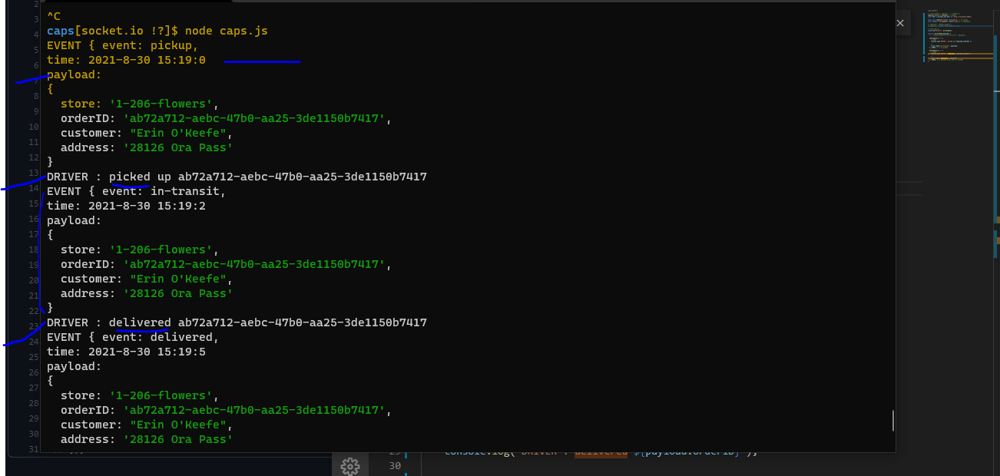

# caps

# Event Driven Applications (lab 11) 29-8

### build CAPS chain system will simulate a delivery service for the shop, it will contain two main parts vendors and the drivers, and should keep them on connect if we the vendor git an order until the driver delivered it.

### Phase 1

- Today, we begin the first of a 4-Phase build of the CAPS system, written in Node.js. In this first phase, our goal is to setup a system of events and handlers, with the intent being to change out the eventing system as we go, but keeping the handlers themselves largely the same. The task of “delivering a package” doesn’t change (the handler), even if the mechanism for triggering that task (the event) does.

### CAPS app

- events.js - Global Event Pool caps.js - Main Hub Application Manages the state of every package Logs every event to the console with a timestamp and the event payload
- vendor.js - Vendor Module Every 5 seconds, simulate a new customer order
  Monitor the system for events … Whenever the ‘delivered’ event occurs “thank you” logged to the console
- driver.js - Drivers Module Monitor the system for events … On the ‘pickup’ event … Wait 1 second Log “DRIVER:: DRIVERname :: picked up : [ORDER_ID]” to the console. Emit an ‘in-transit’ event with the payload you received Wait 3 seconds Log “delivered” to the console Emit a ‘delivered’ event with the same payload

 

## [github links](https://github.com/mr-atta/caps)

 

## SetUp :

- create repo called caps
- clone the repo
- npm init
- npmi i for
  - supertest
  - faker
  - dotenv
  - jest

### running the app : on **node caps.js **

### testing the app : on **npm test**

 

## console output :

## test :

