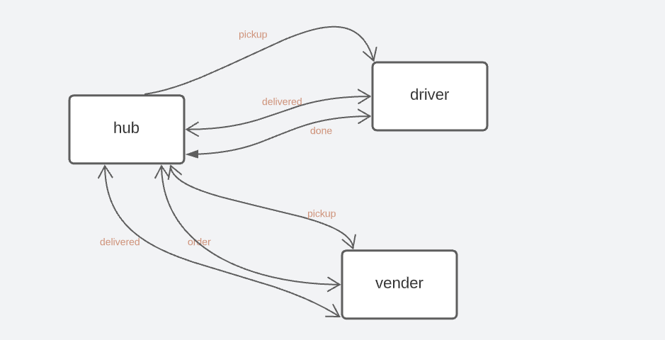
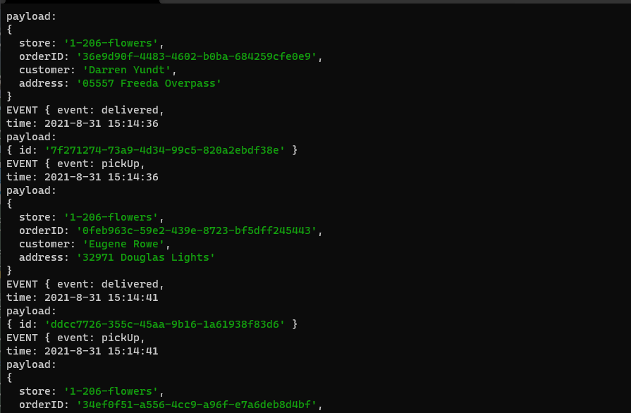
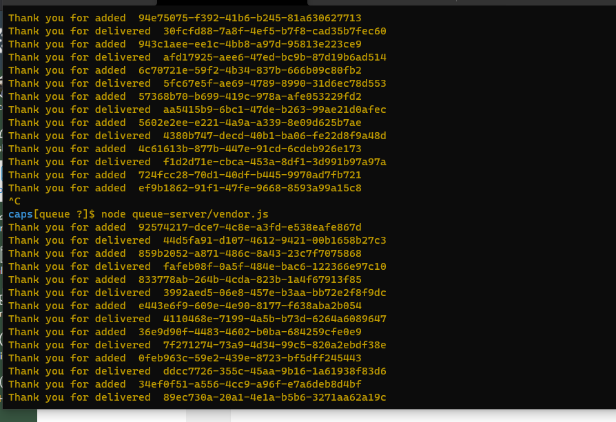
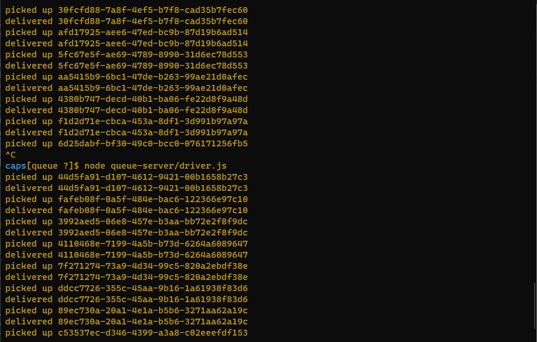
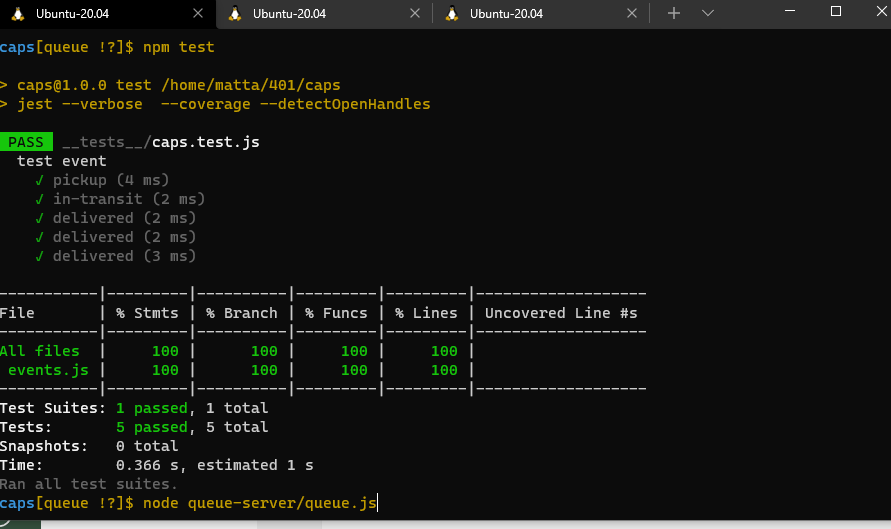

# LAB-13: Message Queues

## Repository

> `caps`

## branch

> `queue`

 

### Phase 3

- adding queued delivery toour delivery tracking system.

> Build a set of applications to manage deliveries made by CAPS Drivers. This will simulate a delivery driver delivering a package and scanning the package code. Retailers will be able to see in their dashboard or log, a list of all packages delivered in real time. Should a delivery driver deliver many packages while the retailer is not connected to the dashboard, the retailer should be able to “catch up” and see a list of all missed events before resuming real-time monitoring

> connecting the pages (driver and the vendor) with hub page without event.js by using :namespace, io-client.

 

## github link :

[github](https://github.com/mr-atta/caps)

## pull request for that branch :

[pull request](https://github.com/mr-atta/caps/compare/queue?expand=1)

 

### running the queue : on **node queue-server/queue.js**

### running the vendor : on **node queue-server/vendor.js**

### running the driver : on **node queue-server/driver.js**

### testing the app : on **npm test** AND on the consle

## SetUp :

- create branch called `socket.io`
- npmi i for
  - supertest
  - faker
  - dotenv
  - jest
  - `socket.io`
  - `socket.io-client`
  - uuid

 

## UML Diagram :

 

## Output result :

### **node queue.js**

### **node vendor.js**

### **node driver.js**

 

- link: http://localhost:3020

- namespace: http://localhost:3020/caps

## test :

