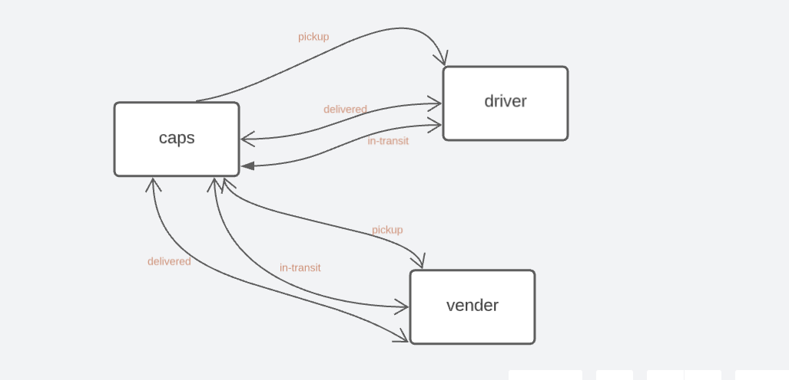
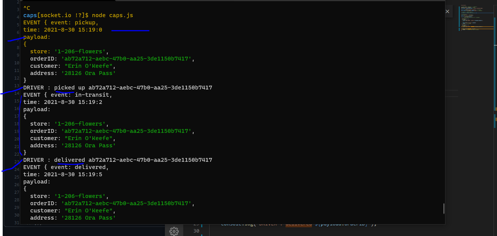
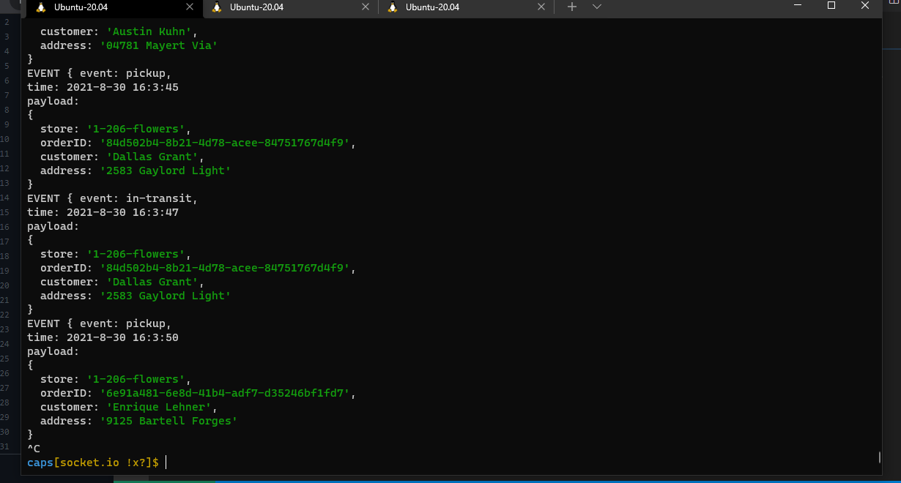
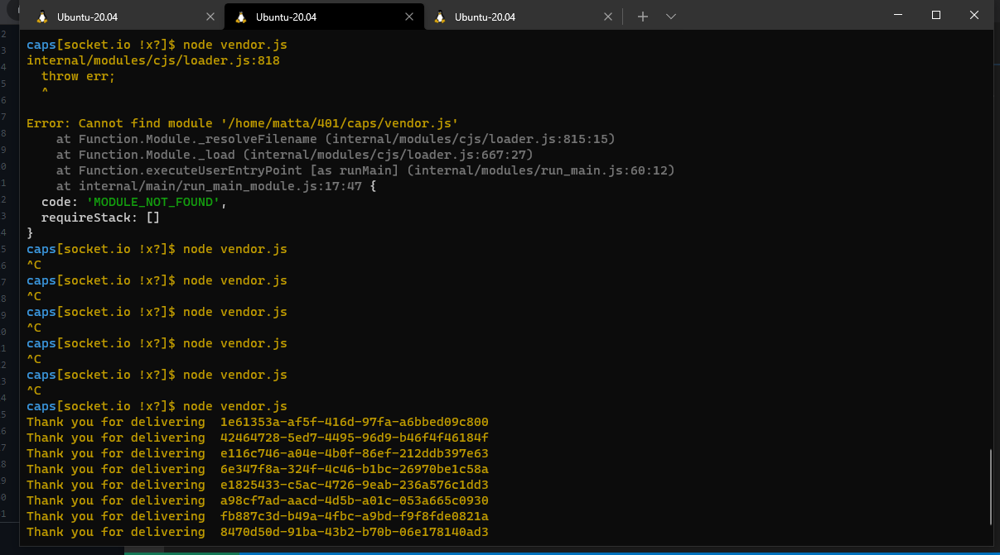
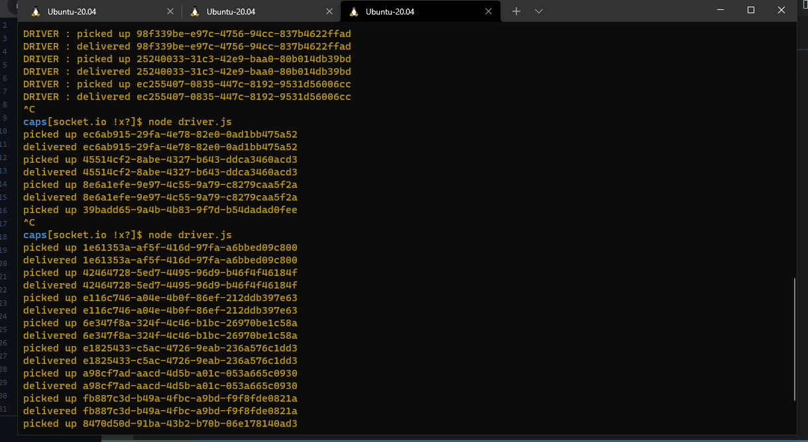

# LAB-12: Socket.io

## Repository

> `caps`

## branch

> `socket.io`

 

### Phase 2

> In Phase 2, we’ll be changing the underlying networking implementation of our CAPS system from using node events to using a library called `socket.io` so that we can do networked events. `Socket.io` manages the connection pool for us, makes broadcasting much easier to operate, and works well both on the terminal (between servers) and with web clients.

> connecting the pages (driver and the vendor) with caps page without event.js by using :namespace, io-client.

 

## github link :

[github](https://github.com/mr-atta/caps)

## pull request for that branch :

[pull request](https://github.com/mr-atta/caps/compare/Socket.io?expand=1)

 

### running the caps : on **node caps.js**

### running the vendor : on **node vendor.js**

### running the driver : on **node driver.js**

### testing the app : on **npm test** AND on the consle

## SetUp :

- create branch called `socket.io`
- npmi i for
  - supertest
  - faker
  - dotenv
  - jest
  - `socket.io`
  - `socket.io-client`

 

## UML Diagram :

 

## Output result :

- The last output result
  

 

- The current output result

### **node caps.js**

### **node vendor.js**

### **node driver.js**

 

- link: http://localhost:3020

- namespace: http://localhost:3020/caps
